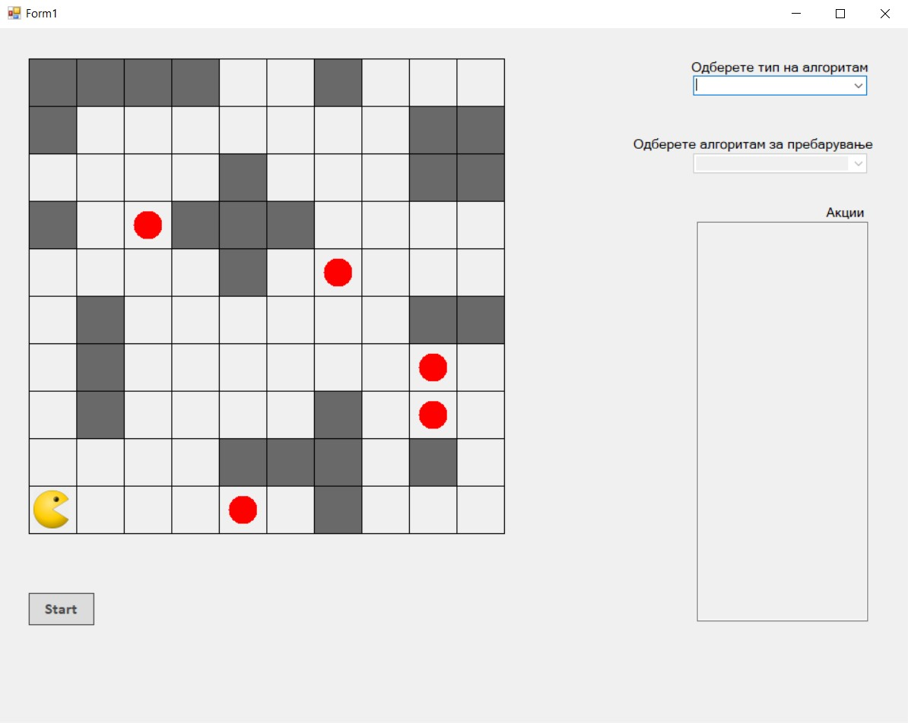
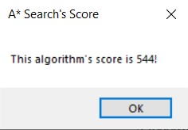
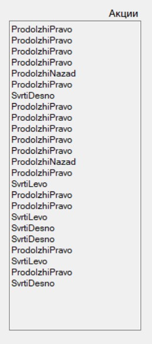

#Проектна задача по Визуелно програмирање

##Searching Algorithms with Pacman

*Windows Forms проект од : Давид Тодоров и Бојан Божилов*

###1. Опис на апликацијата

Апликацијата која ја развиваме претставува симулација на проблем од областа на вештачката интелигенција, каде агентот е главниот лик од популарната видео игра Pacman, а неговата цел е да ги изеде сите пелети со храна во својата околина, притоа истото да го направи на најоптимален можен начин.

Искористени се неколку алгоритми, кои се поделени на алгоритми за:

- неинформирано пребарување
- информирано пребарување.

Кај алгоритмите за неинформирано пребарување, агентот нема никаква идеја каде му е целта и како да ја достигне, па ги испробува сите можни патишта од неговата почетна позиција сè додека не стигне до целта.

Во овој тип на алгоритми спаѓаат:

- BFS (Breadth-First Search),
- DFS (Depth-First Search),
- UCS (Uniform Cost Search).

**BFS** е алгоритам кој пребарува по широчина, односно го наоѓа најплиткото можно решение на проблемот (исто така најоптимално во поглед на бројот на акции, доколку претпоставиме дека сите можни акции имаат еднаква цена на чинење).

**DFS** е алгоритам кој пребарува по длабочина. Тоа значи дека кога ќе тргне по еден пат, истиот го &quot;оди&quot; до крај се додека не налета на слепа улица и во тој случај се враќа назад и скршнува во друга насока.

**UCS** алгоритмот го наоѓа најоптималниот пат во поглед на цена на чинење (наспроти бројот на чекори како кај BFS). Овој алгоритам се користи кога цената на чинење на акциите е различна кај различни акции. Алгоритмот секогаш ја пребарува следната акција во својата приоритетна редица која е со најмала цена на чинење. Доколку се повика UCS кај проблем во кој сите цени на чинење се еднакви, истиот ќе даде решение еднакво на BFS.

Алгоритмите за информирано пребарување се разликуваат од оние за неинформирано со тоа што овде агентот има некоја идеја за тоа каде му се наоѓа целта. Ова познавање се постигнува со хевристичка функција специфична на доменот во кој спаѓа проблемот. Хевристичката функција за секоја состојба во просторот на состојби на проблемот дава апроксимација за тоа колку е далеку целната состојба. За алгоритмите за информирано пребарување да функционираат како што треба, хевристичката функција секогаш треба да дава оптимистички резултат, односно да дава вредност помала од вистинската цена.

Во алгоритмите за информирано пребарување спаѓаат:

- Best-First Search (исто така познат како Greedy Search) и
- А Search.

**Greedy Search** е алгоритам кој за секоја состојба ја пресметува вредноста на хевристичката функција на сите свои соседи и продолжува да се движи во насока каде вредноста е најмала. Бидејќи хевристичката функција е само апроксимација, најчесто овој алгоритам не е оптимален.

**A\* Search** алгоритмот ги комбинира UCS и Greedy Search алгоритмите со тоа што за секој сосед n на моменталната состојба го пресметува збирот f(n) = g(n) + h(n) каде g(n) e цената да се стигне до јазелот n од почетна состојба, а h(n) e вредноста на хевристичката функција на истиот јазел n. Алгоритмот продолжува во насока каде вредноста на f(n) е најмала.

Целта на апликацијата е да се види преку анимациите како одредените алгоритми за пребарување во простор на состојби се разликуваат еден од друг во поглед на решенијата кои ги генерираат и нивната оптималност.

###2. Упатство за користење

При стартување на апликацијата на екранот се појавува прозорец со следниот изглед:



На почетокот корисникот треба да избере тип на алгоритам, односно информирано или неинформирано пребарување. Потоа се овозможува втората Drop Down листа каде зависно од првиот избор, се сместуваат соодветните алгоритми за информирано, односно неинформирано пребарување. Откако корисникот ќе избере конкретен алгоритам, тогаш копчето Start ќе стане овозможено и корисникот со негов клик ќе може да ја почне симулацијата. Симулацијата се состои од анимација кога ги следи чекорите изгенерирани од алгоритмот и го решава проблемот на акумулирање на сите пелети храна во околината.

За време на симулацијата исто така се пресметуваат поени на следниот начин: за секој чекор без храна агентот се казнува со 1 поен, за секоја изедена пелета се наградува 10 поени и за последната изедена пелета се наградува со 500 поени. По завршувањето на анимацијата се појавува известување на екранот за бројот на освоени поени на соодветниот алгоритам. Пораката изгледа вака:



Од десната страна на почетниот прозорец може да се забележи текстуално поле лабелирано како „Акции&quot;. Овде по завршување на алгоритмот во текстуален формат се појавуваат акциите кои ги има изгенерирано алгоритмот.
Исто така откако ќе заврши симулацијата, агентот повторно се позиционира на почетна позиција, а пелетите се појавуваат на истите локации и тогаш корисникот има слобода да избере дали повторно ќе ја изврши истата анимација или ќе одбере некој од другите алгоритми.



(Во оригиналната идеја за апликацијата, требаше листата акции да се прикаже пред да почне анимацијата и при секој чекор да биде селектирана со highlight соодветната акција од листата.)

###3. Објаснување на проблемот

####3.1. Податочни структури

Главните податоци и функции за проблемот се состојат во класите Pacman и Direction.

Класата Direction ја претставува моменталната насока кон која е свртен агентот. Истата содржи податок за X и Y, така што за соодветните насоки вредностите на X и Y се:

- десно – (X=1, Y=0);
- горе – (X=0, Y=-1);
- лево – (X=-1, Y=0);
- долу – (X=0, Y=1);

```c#
    public class Direction
    {
        public int dirX { get; set; }
        public int dirY { get; set; }
    }
    
    public Direction(int dirX, int dirY)
    {
        this.dirX = dirX;
        this.dirY = dirY;
    }

```
Класата исто така содржи функции за промена на моменталната насока, односно за свртување лево, десно или наназад.

```c#
    public void turnLeft()
    {
        if (this.dirX == 0 && this.dirY != 0)
        {
            this.dirX = 1 * this.dirY;
            this.dirY = 0;
        }
        else if (this.dirY == 0 && this.dirX != 0)
        {
            this.dirY = -1 * this.dirX;
            this.dirX = 0;
        }
    }

    public void turnRight()
    {
        if (this.dirX == 0 && this.dirY != 0)
        {
            this.dirX = -1 * this.dirY;
            this.dirY = 0;
        }
        else if (this.dirY == 0 && this.dirX != 0)
        {
            this.dirY = 1 * this.dirX;
            this.dirX = 0;
        }
    }

    public void turnBack()
    {
        this.dirX *= -1;
        this.dirY *= -1;
    }
```

Класата Pacman ја претставува играта со тоа што ги содржи координатите на моменталната положба на агентот, бројот на пиксели за кои се поместува во одредена насока, инстанца од класата Direction, инстанца од класата PictureBox која ја претставува сликата на агентот на работниот прозорец, листата од објекти од класа Point кои претставуваат позициите на сите пелети храна во околината, број на изедени пелети од почетокот на играта, вкупно освоени поени.Во конструкторот се креира агент чија почетна насока е десно, се сетираат бројот на поени и изедена храна на 0, големината на чекорот во пиксели е 50 и листата на точки е пополнета со соодветните вредности.

```c#
    public class Pacman
    {
        public int X { get; set; }
        public int Y { get; set; }
        public int Step { get; set; }
        public Direction Direction { get; set; }
        public PictureBox Picture { get; set; }
        public List<Point> FoodPoints { get; set; }
        public int DotsEaten { get; set; }
        public int Score { get; set; }

        public Pacman(int x, int y, PictureBox picture)
        {
            this.X = x;
            this.Y = y;
            Step = 50;
            Direction = new Direction(1, 0);
            this.Picture = picture;
            FoodPoints = new List<Point>();
            FoodPoints.Add(new Point(205, 455));
            FoodPoints.Add(new Point(105, 155));
            FoodPoints.Add(new Point(305, 205));
            FoodPoints.Add(new Point(405, 305));
            FoodPoints.Add(new Point(405, 355));
            DotsEaten = 0;
        }
    }
```

При движење на агентот, поместувањето се врши така што неговите нови координати се резултат на производите на координатите од инстанцата на Direction со бројот на пиксели од кои се содржи еден чекор. Доколку има потреба од менување на насоката, прво се повикува соодветната функција од Direction класата, па потоа се врши пресметката на новата позиција. При секој чекор доколку се налета на поле на кое нема храна тогаш бројот на поени се намалува за 1; доколку полето содржи храна, бројот на изедени пелети се зголемува за 1, а бројот на поени се зголемува за 10; доколку бројот на изедени пелети ја достигне должината на листата, тогаш се наградува агентот со 500 поени.

Функција за проверка на храна:
```c#
    public void checkForFood()
        {
            foreach (var point in FoodPoints)
            {
                if (point.X.Equals(this.X) && point.Y.Equals(this.Y))
                {
                    Score += 10;
                    DotsEaten += 1;

                    if (DotsEaten == FoodPoints.Count)
                    {
                        Score += 500;
                    }

                    return;
                }
            }

            Score -= 1;
        }
```
Функција за движење напред:
```c#
        public void moveForward()
        {
            this.X += (Step * this.Direction.dirX);
            this.Y += (Step * this.Direction.dirY);
            this.Picture.Location = new Point(this.X, this.Y);

            checkForFood();
        }
```
Функција за движење назад:
```c#   
        public void moveBackward()
        {
            Direction.turnBack();
            moveForward();
            this.Picture.Location = new Point(this.X, this.Y);
        }
```
Функција за движење лево:
```c#
        public void moveLeft()
        {
            Direction.turnLeft();
            moveForward();
            this.Picture.Location = new Point(this.X, this.Y);
        }
```
Функција за движење десно:
```c#
        public void moveRight()
        {
            Direction.turnRight();
            moveForward();
            this.Picture.Location = new Point(this.X, this.Y);
        }
```

####3.2. Функции

Откако по стартување на програмот корисникот ќе одбере тип на алгоритам и конкретна имплементација од двете drop down листи, тогаш се овозможува копчето Start и при негов клик се повикува функцијата button1\_Click().

Во функцијата button1\_Click() се презема името на одбраниот алгоритмот од листата и според него, во променливата script се поставува соодветната патека до Python скриптата која го имплементира алгоритмот. 
```c#
         // 2) Provide script and arguments
            string algorithm = cbTypeAlgorithm.Items[cbTypeAlgorithm.SelectedIndex].ToString();
            string res = "";
            string script = "";

            switch (algorithm)
            {
                case "Breadth-First Search":
                    script = @"Python scripts\main_bfs.py";
                    break;

                case "Depth-First Search":
                    //script = @"Python scripts\main_dfs.py";
                    res = "['SvrtiLevo', 'SvrtiDesno', 'SvrtiDesno', 'SvrtiDesno', 'ProdolzhiNazad', 'SvrtiLevo', 'SvrtiDesno', 'SvrtiDesno', 'SvrtiDesno', 'ProdolzhiNazad', 'SvrtiLevo', 'SvrtiDesno', 'SvrtiDesno', 'SvrtiDesno', 'ProdolzhiNazad', 'SvrtiLevo', 'SvrtiLevo', 'SvrtiDesno', 'SvrtiDesno', 'SvrtiDesno', 'ProdolzhiNazad', 'SvrtiDesno', 'SvrtiLevo', 'SvrtiDesno', 'SvrtiDesno', 'SvrtiDesno', 'ProdolzhiNazad', 'SvrtiLevo', 'SvrtiDesno', 'SvrtiLevo', 'SvrtiDesno', 'SvrtiDesno', 'SvrtiDesno', 'ProdolzhiNazad', 'SvrtiDesno', 'SvrtiLevo', 'SvrtiLevo', 'SvrtiDesno', 'SvrtiDesno', 'SvrtiDesno', 'ProdolzhiNazad', 'SvrtiDesno', 'ProdolzhiNazad', 'ProdolzhiPravo', 'SvrtiLevo', 'SvrtiLevo', 'SvrtiDesno', 'SvrtiDesno', 'SvrtiDesno', 'ProdolzhiNazad', 'SvrtiDesno', 'SvrtiLevo', 'SvrtiDesno', 'SvrtiDesno', 'SvrtiDesno', 'SvrtiDesno', 'SvrtiLevo', 'SvrtiDesno', 'SvrtiDesno', 'SvrtiDesno', 'ProdolzhiNazad', 'SvrtiDesno', 'SvrtiDesno', 'SvrtiDesno', 'SvrtiLevo', 'SvrtiDesno', 'SvrtiDesno', 'ProdolzhiNazad', 'SvrtiDesno', 'SvrtiLevo', 'SvrtiLevo', 'SvrtiDesno', 'SvrtiDesno', 'SvrtiDesno', 'ProdolzhiNazad', 'SvrtiDesno', 'ProdolzhiNazad', 'ProdolzhiPravo', 'SvrtiLevo', 'SvrtiLevo', 'SvrtiDesno', 'SvrtiDesno', 'SvrtiDesno', 'ProdolzhiNazad', 'SvrtiDesno', 'ProdolzhiPravo', 'SvrtiDesno', 'SvrtiLevo', 'SvrtiDesno', 'SvrtiDesno', 'SvrtiDesno', 'ProdolzhiNazad', 'SvrtiLevo', 'SvrtiLevo', 'SvrtiLevo', 'SvrtiDesno', 'SvrtiDesno', 'SvrtiDesno', 'ProdolzhiNazad', 'SvrtiDesno', 'SvrtiLevo', 'SvrtiDesno', 'SvrtiDesno', 'SvrtiDesno', 'ProdolzhiNazad', 'SvrtiLevo', 'SvrtiLevo', 'SvrtiDesno', 'SvrtiDesno', 'SvrtiDesno', 'ProdolzhiNazad', 'SvrtiDesno', 'SvrtiLevo', 'SvrtiLevo', 'SvrtiDesno', 'SvrtiLevo', 'SvrtiDesno', 'SvrtiDesno', 'SvrtiDesno', 'ProdolzhiNazad', 'SvrtiLevo', 'SvrtiDesno', 'SvrtiDesno', 'SvrtiDesno', 'ProdolzhiNazad', 'SvrtiLevo', 'SvrtiDesno', 'ProdolzhiNazad', 'SvrtiDesno', 'SvrtiLevo', 'SvrtiDesno', 'SvrtiDesno', 'SvrtiDesno', 'ProdolzhiNazad', 'SvrtiDesno', 'SvrtiLevo', 'ProdolzhiNazad', 'SvrtiDesno', 'ProdolzhiPravo', 'SvrtiDesno', 'SvrtiLevo', 'SvrtiDesno', 'SvrtiDesno', 'SvrtiDesno', 'ProdolzhiNazad', 'SvrtiLevo', 'SvrtiDesno', 'SvrtiDesno', 'SvrtiDesno', 'ProdolzhiNazad', 'SvrtiLevo', 'SvrtiDesno', 'SvrtiDesno', 'SvrtiDesno', 'ProdolzhiNazad', 'SvrtiDesno', 'SvrtiLevo', 'SvrtiDesno', 'SvrtiDesno', 'SvrtiDesno', 'ProdolzhiNazad', 'SvrtiDesno', 'ProdolzhiNazad', 'ProdolzhiPravo', 'SvrtiLevo', 'SvrtiLevo', 'SvrtiDesno', 'SvrtiDesno', 'SvrtiDesno', 'ProdolzhiNazad', 'SvrtiLevo', 'SvrtiDesno', 'SvrtiDesno', 'SvrtiDesno', 'ProdolzhiNazad', 'ProdolzhiPravo']";
                    Thread.Sleep(500);
                    break;

                case "Uniform Cost Search":
                    script = @"Python scripts\main_ucs.py";
                    break;

                case "A* Search":
                    script = @"Python scripts\main_a-star.py";
                    break;

                case "Best-First Search":
                    script = @"Python scripts\main_best-first.py";
                    break;
            }
```
Потоа со помош на инстанца од класта ProcessStartInfo, скриптата се поставува како аргумент и објектот го повикува Python кодот да се изврши. Резултатот што го враќа се поставува во string променливата result и истата се праќа како аргумент на функцијата getActions() која враќа низа од акциите кои ги вратил алгоритмот.
```c#
        string results;
        if (algorithm == "Depth-First Search")
        {
            results = res;
        }
        else
        {
            psi.Arguments = $"\"{script}\"";

            // 3) Process configuration
            psi.UseShellExecute = false;
            psi.CreateNoWindow = true;
            psi.RedirectStandardOutput = true;
            psi.RedirectStandardError = true;

            // 4) Execute process and get output
            using (var process = Process.Start(psi))
            {
                results = process.StandardOutput.ReadToEnd();
            }
        }
``` 
За крај се креира нова инстанца од класата Pacman, низата од чекори се печати во текст полето за Акции и се повикува функцијата Animate() со низата од чекори како нејзин аргумент.
```c#
        picBoxPacman.Location = new Point(5, 455);
        Pacman = new Pacman(5, 455, picBoxPacman);

        string[] resultsArr = getActions(results);
        printActions(resultsArr);
            
        Invalidate();
        Animate(resultsArr);
```
```c#
        public void printActions(string[] actions)
        {
            // 5) Display output
            StringBuilder sb = new StringBuilder();
            foreach (string s in actions)
            {
                sb.Append(s).AppendLine();
            }

            textBox1.Text = sb.ToString();
        }
```
```c#
        public string[] getActions(string results)
        {
            results = results.Trim().Replace("[", String.Empty)
                .Replace("]", String.Empty).Replace("\'", String.Empty);
            string[] resultsArr = Regex.Split(results, ",\\s");

            for (int i = 0; i < resultsArr.Length; i++)
            {
                resultsArr[i] = resultsArr[i].Replace("\'", string.Empty);
            }

            return resultsArr;
        }
```
Функцијата Animate() ја зема низата од акции и за одредена акција (ProdolzhiPravo, ProdolzhiNazad, SvrtiLevo, SvrtiDesno) повикува соодветна функција за движење која се наоѓа во класата Pacman. Откако агентот ќе заврши со движењето, се ресетира неговата позиција и пелетите храна на нивните соодветни почетни полиња, и се појавува MessageBox коенè известува за поените на претходно избраниот алгоритам.
```c#
        public void Animate(string[] array)
        {
            foreach (string action in array)
            {
                switch (action)
                {
                    case "ProdolzhiPravo":
                    {
                            Pacman.moveForward();
                            break;
                    }

                    case "ProdolzhiNazad":
                    {
                            Pacman.moveBackward();
                            break;
                    }

                    case "SvrtiLevo":
                    {
                            Pacman.moveLeft();
                            break;
                    }

                    case "SvrtiDesno":
                    {
                            Pacman.moveRight();
                            break;
                    }
                }

                Invalidate();
                Thread.Sleep(300);
            }

            string message = "This algorithm's score is ";
            message += Pacman.Score.ToString() + "!";
            string algorithm = cbTypeAlgorithm.Items[cbTypeAlgorithm.SelectedIndex].ToString();
            string title = algorithm + "'s Score";

            Pacman = new Pacman(5, 455, picBoxPacman);

            MessageBox.Show(message, title);
        }
```